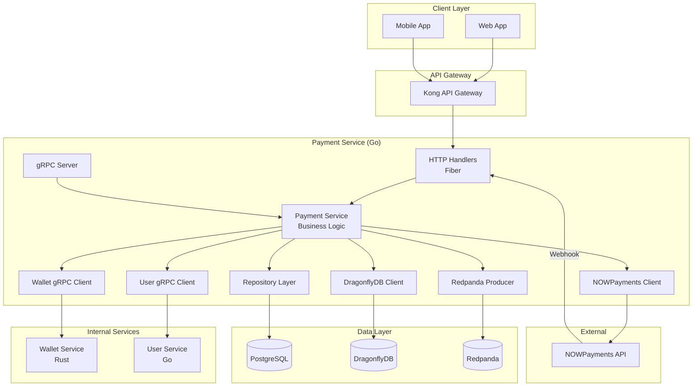
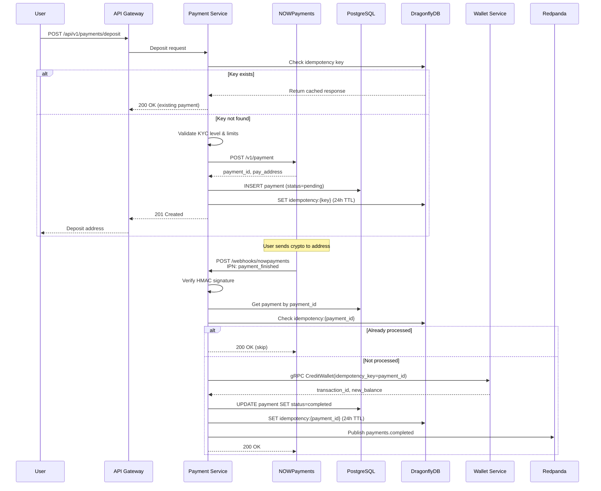
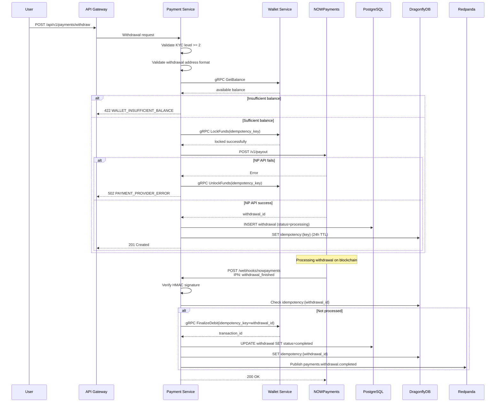

# Design Document: NOWPayments Integration

## Overview

Интеграция NOWPayments для приёма крипто-платежей (депозиты и выводы) на гемблинг-платформе с 10M+ пользователей. Payment Service (Go) оркестрирует платежные операции, Wallet Service (Rust) управляет балансами.

### Key Design Decisions

| Decision | Rationale |
|----------|-----------|
| Payment Service на Go | Быстрая разработка, интеграции с внешними API, не критический путь |
| Idempotency на двух уровнях | DragonflyDB (fast path) + PostgreSQL UNIQUE constraint (safety net) |
| Webhook HMAC verification | Защита от подделки уведомлений от NOWPayments |
| Saga pattern для выводов | Компенсирующие транзакции при ошибках |
| Exchange rates caching | Снижение нагрузки на NOWPayments API, TTL 60s |

### System Context

```
┌─────────────────────────────────────────────────────────────────────┐
│                         External Systems                            │
├─────────────────────────────────────────────────────────────────────┤
│  NOWPayments API          │  Blockchain Networks                   │
│  - Create payment         │  - BTC, ETH, USDT, USDC, LTC, BCH      │
│  - Create withdrawal      │  - ERC-20, TRC-20 tokens               │
│  - Get exchange rates     │                                        │
│  - IPN webhooks           │                                        │
└─────────────────────────────────────────────────────────────────────┘
              │                                    │
              │ HTTPS                              │ Webhooks
              ▼                                    ▼
┌─────────────────────────────────────────────────────────────────────┐
│                        Payment Service (Go)                         │
│  - NOWPayments client with retry logic                             │
│  - Webhook handler with HMAC verification                          │
│  - KYC limits enforcement                                          │
│  - Exchange rate caching                                           │
│  - Idempotency management                                          │
└─────────────────────────────────────────────────────────────────────┘
              │                                    │
              │ gRPC                               │ Redpanda
              ▼                                    ▼
┌───────────────────────────────┐    ┌───────────────────────────────┐
│    Wallet Service (Rust)      │    │         Redpanda              │
│    - Balance operations       │    │  - payments.completed         │
│    - Ledger entries           │    │  - payments.failed            │
│    - Double-entry bookkeeping │    │  - payments.withdrawal.*      │
└───────────────────────────────┘    │  - payments.audit             │
                                     └───────────────────────────────┘
```

---

## Architecture

### Component Diagram



### Sequence Diagram: Deposit Flow



### Sequence Diagram: Withdrawal Flow



---

## Components and Interfaces

### Payment Service Structure

```
services/payment-service/
├── cmd/server/main.go
├── internal/
│   ├── config/
│   │   └── config.go
│   ├── domain/
│   │   ├── payment.go
│   │   ├── withdrawal.go
│   │   ├── crypto_currency.go
│   │   ├── payment_status.go
│   │   └── errors.go
│   ├── service/
│   │   ├── payment_service.go
│   │   ├── withdrawal_service.go
│   │   ├── webhook_service.go
│   │   ├── exchange_rate_service.go
│   │   ├── kyc_limits_service.go
│   │   └── idempotency_service.go
│   ├── repository/
│   │   ├── interfaces.go
│   │   ├── payment_repo.go
│   │   ├── withdrawal_repo.go
│   │   └── audit_log_repo.go
│   ├── handler/
│   │   ├── payment_handler.go
│   │   ├── withdrawal_handler.go
│   │   ├── webhook_handler.go
│   │   ├── response.go
│   │   └── middleware.go
│   ├── grpc/
│   │   └── server.go
│   ├── event/
│   │   ├── producer.go
│   │   └── events.go
│   └── client/
│       ├── wallet_client.go
│       ├── user_client.go
│       └── nowpayments_client.go
├── migrations/
│   ├── 001_create_payments.up.sql
│   ├── 002_create_withdrawals.up.sql
│   └── 003_create_audit_logs.up.sql
└── config/
    ├── default.yaml
    └── production.yaml
```

### Go Interfaces

```go
// internal/repository/interfaces.go

package repository

import (
    "context"
    "github.com/shopspring/decimal"
    "github.com/google/uuid"
    "github.com/platform/services/payment-service/internal/domain"
)

// PaymentRepository manages payment records in PostgreSQL
type PaymentRepository interface {
    Create(ctx context.Context, payment *domain.Payment) error
    GetByID(ctx context.Context, id int64) (*domain.Payment, error)
    GetByPaymentID(ctx context.Context, paymentID string) (*domain.Payment, error)
    GetByIDempotencyKey(ctx context.Context, key string) (*domain.Payment, error)
    UpdateStatus(ctx context.Context, id int64, fromStatus, toStatus domain.PaymentStatus) error
    UpdateActualAmount(ctx context.Context, id int64, actualAmount decimal.Decimal) error
    ListByUserID(ctx context.Context, userID int64, filter ListFilter) ([]*domain.Payment, string, error)
}

// WithdrawalRepository manages withdrawal records
type WithdrawalRepository interface {
    Create(ctx context.Context, withdrawal *domain.Withdrawal) error
    GetByID(ctx context.Context, id int64) (*domain.Withdrawal, error)
    GetByWithdrawalID(ctx context.Context, withdrawalID string) (*domain.Withdrawal, error)
    GetByIDempotencyKey(ctx context.Context, key string) (*domain.Withdrawal, error)
    UpdateStatus(ctx context.Context, id int64, fromStatus, toStatus domain.WithdrawalStatus) error
    ListByUserID(ctx context.Context, userID int64, filter ListFilter) ([]*domain.Withdrawal, string, error)
}

// IdempotencyRepository manages idempotency keys in DragonflyDB
type IdempotencyRepository interface {
    Get(ctx context.Context, key string) ([]byte, bool, error)
    Set(ctx context.Context, key string, value []byte, ttlSeconds int) error
    SetNX(ctx context.Context, key string, value []byte, ttlSeconds int) (bool, error)
}

// ExchangeRateRepository caches exchange rates
type ExchangeRateRepository interface {
    Get(ctx context.Context, fromCurrency, toCurrency string) (*decimal.Decimal, error)
    Set(ctx context.Context, fromCurrency, toCurrency string, rate decimal.Decimal, ttlSeconds int) error
}

// DailyLimitsRepository tracks daily cumulative amounts
type DailyLimitsRepository interface {
    Increment(ctx context.Context, userID int64, operationType string, amount decimal.Decimal) (decimal.Decimal, error)
    Get(ctx context.Context, userID int64, operationType string) (decimal.Decimal, error)
}
```

### Domain Types

```go
// internal/domain/payment.go

package domain

import (
    "time"
    "github.com/google/uuid"
    "github.com/shopspring/decimal"
)

type Payment struct {
    ID              int64
    UUID            uuid.UUID
    UserID          int64
    PaymentID       string              // NOWPayments payment_id
    IdempotencyKey  string
    
    // Amounts
    RequestedAmount decimal.Decimal
    ActualAmount    *decimal.Decimal    // May differ from requested
    FiatAmount      decimal.Decimal     // USD equivalent
    FiatCurrency    string              // Always USD
    
    // Crypto details
    CryptoCurrency  string
    PayAddress      string              // Deposit address
    PayAmount       *decimal.Decimal    // Expected crypto amount
    
    // Status
    Status          PaymentStatus
    
    // Timestamps
    CreatedAt       time.Time
    UpdatedAt       time.Time
    CompletedAt     *time.Time
    ExpiresAt       *time.Time
    
    // Metadata
    IPAddress       string
    UserAgent       string
}

type PaymentStatus string

const (
    PaymentStatusPending   PaymentStatus = "pending"
    PaymentStatusWaiting   PaymentStatus = "waiting"   // Waiting for crypto
    PaymentStatusConfirming PaymentStatus = "confirming"
    PaymentStatusConfirmed PaymentStatus = "confirmed"
    PaymentStatusSending   PaymentStatus = "sending"
    PaymentStatusPartiallyPaid PaymentStatus = "partially_paid"
    PaymentStatusFinished  PaymentStatus = "finished"
    PaymentStatusFailed    PaymentStatus = "failed"
    PaymentStatusExpired   PaymentStatus = "expired"
    PaymentStatusRefunded  PaymentStatus = "refunded"
)

func (s PaymentStatus) IsFinal() bool {
    return s == PaymentStatusFinished || 
           s == PaymentStatusFailed || 
           s == PaymentStatusExpired ||
           s == PaymentStatusRefunded
}

func (s PaymentStatus) IsSuccess() bool {
    return s == PaymentStatusFinished
}

// Valid transitions for payment status
var paymentTransitions = map[PaymentStatus][]PaymentStatus{
    PaymentStatusPending:    {PaymentStatusWaiting, PaymentStatusFailed, PaymentStatusExpired},
    PaymentStatusWaiting:    {PaymentStatusConfirming, PaymentStatusPartiallyPaid, PaymentStatusFailed, PaymentStatusExpired},
    PaymentStatusConfirming: {PaymentStatusConfirmed, PaymentStatusPartiallyPaid, PaymentStatusFailed},
    PaymentStatusConfirmed:  {PaymentStatusSending, PaymentStatusFinished},
    PaymentStatusSending:    {PaymentStatusFinished, PaymentStatusFailed},
    PaymentStatusPartiallyPaid: {PaymentStatusFinished, PaymentStatusFailed},
}

func (s PaymentStatus) CanTransitionTo(target PaymentStatus) bool {
    allowed, ok := paymentTransitions[s]
    if !ok {
        return false
    }
    for _, t := range allowed {
        if t == target {
            return true
        }
    }
    return false
}
```

```go
// internal/domain/withdrawal.go

package domain

type Withdrawal struct {
    ID              int64
    UUID            uuid.UUID
    UserID          int64
    WithdrawalID    string              // NOWPayments withdrawal_id
    IdempotencyKey  string
    
    // Amounts
    Amount          decimal.Decimal
    FiatAmount      decimal.Decimal
    FiatCurrency    string
    
    // Crypto details
    CryptoCurrency  string
    Address         string              // Destination address
    
    // Status
    Status          WithdrawalStatus
    
    // Timestamps
    CreatedAt       time.Time
    UpdatedAt       time.Time
    CompletedAt     *time.Time
    
    // Metadata
    IPAddress       string
    UserAgent       string
}

type WithdrawalStatus string

const (
    WithdrawalStatusProcessing WithdrawalStatus = "processing"
    WithdrawalStatusSending    WithdrawalStatus = "sending"
    WithdrawalStatusSent       WithdrawalStatus = "sent"
    WithdrawalStatusFinished   WithdrawalStatus = "finished"
    WithdrawalStatusFailed     WithdrawalStatus = "failed"
    WithdrawalStatusCancelled  WithdrawalStatus = "cancelled"
)

func (s WithdrawalStatus) IsFinal() bool {
    return s == WithdrawalStatusFinished || 
           s == WithdrawalStatusFailed ||
           s == WithdrawalStatusCancelled
}
```

```go
// internal/domain/errors.go

package domain

import "errors"

// Payment errors (5000-5999 range)
var (
    ErrPaymentNotFound          = errors.New("payment not found")
    ErrPaymentAlreadyProcessed  = errors.New("payment already processed")
    ErrPaymentExpired           = errors.New("payment has expired")
    
    ErrKYCRequired              = errors.New("KYC level 2 required for withdrawals")
    ErrDailyLimitExceeded       = errors.New("daily limit exceeded")
    
    ErrInsufficientBalance      = errors.New("insufficient balance")
    ErrWalletLocked             = errors.New("wallet is locked")
    
    ErrInvalidCryptoAddress     = errors.New("invalid crypto address format")
    ErrCurrencyNotSupported     = errors.New("cryptocurrency not supported")
    ErrProviderUnavailable      = errors.New("payment provider unavailable")
    ErrWebhookSignatureInvalid  = errors.New("webhook signature verification failed")
)

// DetailedError provides additional context for errors
type DetailedError struct {
    Err     error
    Details map[string]interface{}
}

func (e *DetailedError) Error() string { return e.Err.Error() }
func (e *DetailedError) Unwrap() error { return e.Err }

func WithDetails(err error, details map[string]interface{}) *DetailedError {
    return &DetailedError{Err: err, Details: details}
}
```

### NOWPayments Client

```go
// internal/client/nowpayments_client.go

package client

import (
    "context"
    "crypto/hmac"
    "crypto/sha512"
    "encoding/hex"
    "encoding/json"
    "fmt"
    "io"
    "net/http"
    "time"
    
    "github.com/shopspring/decimal"
)

type NOWPaymentsClient struct {
    baseURL    string
    apiKey     string
    ipnSecret  string
    httpClient *http.Client
}

type NOWPaymentsConfig struct {
    BaseURL   string
    APIKey    string
    IPNSecret string
    Timeout   time.Duration
}

func NewNOWPaymentsClient(cfg NOWPaymentsConfig) *NOWPaymentsClient {
    return &NOWPaymentsClient{
        baseURL:   cfg.BaseURL,
        apiKey:    cfg.APIKey,
        ipnSecret: cfg.IPNSecret,
        httpClient: &http.Client{
            Timeout: cfg.Timeout,
        },
    }
}

// CreatePayment creates a new payment in NOWPayments
func (c *NOWPaymentsClient) CreatePayment(ctx context.Context, req CreatePaymentRequest) (*CreatePaymentResponse, error) {
    // POST /v1/payment
    // Returns: payment_id, pay_address, pay_amount, etc.
}

// CreatePayout creates a withdrawal in NOWPayments
func (c *NOWPaymentsClient) CreatePayout(ctx context.Context, req CreatePayoutRequest) (*CreatePayoutResponse, error) {
    // POST /v1/payout
    // Returns: withdrawal_id, status, etc.
}

// GetEstimatedPrice gets exchange rate
func (c *NOWPaymentsClient) GetEstimatedPrice(ctx context.Context, amount decimal.Decimal, fromCurrency, toCurrency string) (*EstimatedPriceResponse, error) {
    // GET /v1/estimate?amount={}&currency_from={}&currency_to={}
}

// GetCurrencies gets list of supported currencies
func (c *NOWPaymentsClient) GetCurrencies(ctx context.Context) (*CurrenciesResponse, error) {
    // GET /v1/currencies
}

// VerifyWebhookSignature verifies HMAC signature of webhook payload
func (c *NOWPaymentsClient) VerifyWebhookSignature(payload []byte, signature string) bool {
    mac := hmac.New(sha512.New, []byte(c.ipnSecret))
    mac.Write(payload)
    expectedMAC := hex.EncodeToString(mac.Sum(nil))
    return hmac.Equal([]byte(signature), []byte(expectedMAC))
}

// Request/Response types
type CreatePaymentRequest struct {
    PriceAmount    decimal.Decimal `json:"price_amount"`
    PriceCurrency  string          `json:"price_currency"`
    PayCurrency    string          `json:"pay_currency"`
    IPNCallbackURL string          `json:"ipn_callback_url"`
    OrderID        string          `json:"order_id"`
    OrderDescription string        `json:"order_description,omitempty"`
}

type CreatePaymentResponse struct {
    PaymentID     string          `json:"payment_id"`
    PaymentStatus string          `json:"payment_status"`
    PayAddress    string          `json:"pay_address"`
    PayAmount     decimal.Decimal `json:"pay_amount"`
    PayCurrency   string          `json:"pay_currency"`
    PriceAmount   decimal.Decimal `json:"price_amount"`
    PriceCurrency string          `json:"price_currency"`
    CreatedAt     time.Time       `json:"created_at"`
    ExpiresAt     time.Time       `json:"expiration_estimate_date"`
}

type CreatePayoutRequest struct {
    WithdrawalID string          `json:"withdrawal_id"`
    Address      string          `json:"address"`
    Currency     string          `json:"currency"`
    Amount       decimal.Decimal `json:"amount"`
    IPNCallbackURL string        `json:"ipn_callback_url"`
}

type CreatePayoutResponse struct {
    WithdrawalID   string          `json:"withdrawal_id"`
    Status         string          `json:"status"`
    Amount         decimal.Decimal `json:"amount"`
    Currency       string          `json:"currency"`
    Address        string          `json:"address"`
    BatchID        string          `json:"batch_id,omitempty"`
}
```

### Wallet Service gRPC Client

```go
// internal/client/wallet_client.go

package client

import (
    "context"
    "time"
    
    "github.com/shopspring/decimal"
    "google.golang.org/grpc"
    "google.golang.org/grpc/credentials/insecure"
    
    walletpb "github.com/platform/proto/gen/go/platform/wallet/v1"
)

type WalletClient struct {
    client walletpb.WalletServiceClient
    conn   *grpc.ClientConn
}

func NewWalletClient(address string) (*WalletClient, error) {
    conn, err := grpc.NewClient(address,
        grpc.WithTransportCredentials(insecure.NewCredentials()),
    )
    if err != nil {
        return nil, fmt.Errorf("connect wallet service: %w", err)
    }
    
    return &WalletClient{
        client: walletpb.NewWalletServiceClient(conn),
        conn:   conn,
    }, nil
}

func (c *WalletClient) Close() error {
    return c.conn.Close()
}

// GetBalance returns user's available balance
func (c *WalletClient) GetBalance(ctx context.Context, userID int64, currency string) (*Balance, error) {
    ctx, cancel := context.WithTimeout(ctx, 3*time.Second)
    defer cancel()
    
    resp, err := c.client.GetBalance(ctx, &walletpb.GetBalanceRequest{
        UserId:       userID,
        CurrencyCode: currency,
    })
    if err != nil {
        return nil, mapWalletError(err)
    }
    
    return &Balance{
        Available: parseDecimal(resp.Available),
        Locked:    parseDecimal(resp.Locked),
        Total:     parseDecimal(resp.Total),
    }, nil
}

// CreditWallet credits user's wallet (for deposits)
func (c *WalletClient) CreditWallet(ctx context.Context, req CreditRequest) (*CreditResult, error) {
    ctx, cancel := context.WithTimeout(ctx, 5*time.Second)
    defer cancel()
    
    resp, err := c.client.Credit(ctx, &walletpb.CreditRequest{
        UserId:         req.UserID,
        CurrencyCode:   req.Currency,
        Amount:         req.Amount.String(),
        IdempotencyKey: req.IdempotencyKey,
        ReferenceType:  req.ReferenceType,
        ReferenceId:    req.ReferenceID,
    })
    if err != nil {
        return nil, mapWalletError(err)
    }
    
    return &CreditResult{
        TransactionID: resp.TransactionId,
        NewBalance:    parseDecimal(resp.NewBalance),
    }, nil
}

// LockFunds locks funds for withdrawal
func (c *WalletClient) LockFunds(ctx context.Context, req LockRequest) (*LockResult, error) {
    ctx, cancel := context.WithTimeout(ctx, 5*time.Second)
    defer cancel()
    
    resp, err := c.client.LockFunds(ctx, &walletpb.LockFundsRequest{
        UserId:         req.UserID,
        CurrencyCode:   req.Currency,
        Amount:         req.Amount.String(),
        IdempotencyKey: req.IdempotencyKey,
        ReferenceType:  "withdrawal",
    })
    if err != nil {
        return nil, mapWalletError(err)
    }
    
    return &LockResult{
        LockID:     resp.LockId,
        NewBalance: parseDecimal(resp.NewBalance),
    }, nil
}

// UnlockFunds unlocks funds after failed withdrawal
func (c *WalletClient) UnlockFunds(ctx context.Context, lockID string, idempotencyKey string) error {
    ctx, cancel := context.WithTimeout(ctx, 5*time.Second)
    defer cancel()
    
    _, err := c.client.UnlockFunds(ctx, &walletpb.UnlockFundsRequest{
        LockId:         lockID,
        IdempotencyKey: idempotencyKey,
    })
    return mapWalletError(err)
}

// FinalizeDebit finalizes withdrawal after successful payout
func (c *WalletClient) FinalizeDebit(ctx context.Context, req FinalizeDebitRequest) (*DebitResult, error) {
    ctx, cancel := context.WithTimeout(ctx, 5*time.Second)
    defer cancel()
    
    resp, err := c.client.FinalizeDebit(ctx, &walletpb.FinalizeDebitRequest{
        UserId:         req.UserID,
        CurrencyCode:   req.Currency,
        Amount:         req.Amount.String(),
        IdempotencyKey: req.IdempotencyKey,
        ReferenceType:  "withdrawal",
        ReferenceId:    req.ReferenceID,
    })
    if err != nil {
        return nil, mapWalletError(err)
    }
    
    return &DebitResult{
        TransactionID: resp.TransactionId,
    }, nil
}
```

---

## Data Models

### PostgreSQL Tables

```sql
-- migrations/001_create_payments.up.sql

-- Payment status enum
CREATE TYPE payment_status AS ENUM (
    'pending', 'waiting', 'confirming', 'confirmed', 
    'sending', 'partially_paid', 'finished', 'failed', 
    'expired', 'refunded'
);

-- Payments table
CREATE TABLE payments (
    id              BIGSERIAL PRIMARY KEY,
    uuid            UUID NOT NULL UNIQUE,
    user_id         BIGINT NOT NULL,
    payment_id      VARCHAR(100) NOT NULL UNIQUE,  -- NOWPayments ID
    idempotency_key VARCHAR(255) NOT NULL UNIQUE,  -- Client-generated
    
    -- Amounts (NUMERIC for precision)
    requested_amount NUMERIC(18, 8) NOT NULL,
    actual_amount    NUMERIC(18, 8),
    fiat_amount      NUMERIC(18, 2) NOT NULL,
    fiat_currency    CHAR(3) NOT NULL DEFAULT 'USD',
    
    -- Crypto details
    crypto_currency  VARCHAR(20) NOT NULL,
    pay_address      VARCHAR(255) NOT NULL,
    pay_amount       NUMERIC(18, 8),
    
    -- Status
    status           payment_status NOT NULL DEFAULT 'pending',
    
    -- Timestamps
    created_at       TIMESTAMPTZ NOT NULL DEFAULT NOW(),
    updated_at       TIMESTAMPTZ NOT NULL DEFAULT NOW(),
    completed_at     TIMESTAMPTZ,
    expires_at       TIMESTAMPTZ,
    
    -- Metadata
    ip_address       INET,
    user_agent       VARCHAR(500)
);

-- Indexes for common queries
CREATE INDEX idx_payments_user_id_created ON payments(user_id, created_at DESC);
CREATE INDEX idx_payments_payment_id ON payments(payment_id);
CREATE INDEX idx_payments_idempotency_key ON payments(idempotency_key);
CREATE INDEX idx_payments_status_created ON payments(status, created_at) 
    WHERE status NOT IN ('finished', 'failed', 'expired', 'refunded');

-- Partial index for active payments
CREATE INDEX idx_payments_active ON payments(user_id, created_at DESC)
    WHERE status IN ('pending', 'waiting', 'confirming', 'confirmed', 'sending');
```

```sql
-- migrations/002_create_withdrawals.up.sql

-- Withdrawal status enum
CREATE TYPE withdrawal_status AS ENUM (
    'processing', 'sending', 'sent', 'finished', 'failed', 'cancelled'
);

-- Withdrawals table
CREATE TABLE withdrawals (
    id              BIGSERIAL PRIMARY KEY,
    uuid            UUID NOT NULL UNIQUE,
    user_id         BIGINT NOT NULL,
    withdrawal_id   VARCHAR(100) NOT NULL UNIQUE,  -- NOWPayments ID
    idempotency_key VARCHAR(255) NOT NULL UNIQUE,
    
    -- Amounts
    amount          NUMERIC(18, 8) NOT NULL,
    fiat_amount     NUMERIC(18, 2) NOT NULL,
    fiat_currency   CHAR(3) NOT NULL DEFAULT 'USD',
    
    -- Crypto details
    crypto_currency VARCHAR(20) NOT NULL,
    address         VARCHAR(255) NOT NULL,
    
    -- Status
    status          withdrawal_status NOT NULL DEFAULT 'processing',
    
    -- Timestamps
    created_at      TIMESTAMPTZ NOT NULL DEFAULT NOW(),
    updated_at      TIMESTAMPTZ NOT NULL DEFAULT NOW(),
    completed_at    TIMESTAMPTZ,
    
    -- Metadata
    ip_address      INET,
    user_agent      VARCHAR(500)
);

-- Indexes
CREATE INDEX idx_withdrawals_user_id_created ON withdrawals(user_id, created_at DESC);
CREATE INDEX idx_withdrawals_withdrawal_id ON withdrawals(withdrawal_id);
CREATE INDEX idx_withdrawals_idempotency_key ON withdrawals(idempotency_key);
CREATE INDEX idx_withdrawals_status ON withdrawals(status) 
    WHERE status IN ('processing', 'sending');
```

```sql
-- migrations/003_create_audit_logs.up.sql

-- Audit log for all payment operations
CREATE TABLE payment_audit_logs (
    id              BIGSERIAL PRIMARY KEY,
    user_id         BIGINT NOT NULL,
    operation_type  VARCHAR(50) NOT NULL,  -- 'deposit', 'withdrawal', 'webhook'
    operation_id    BIGINT,                -- payment_id or withdrawal_id
    reference_type  VARCHAR(50),           -- 'payment', 'withdrawal'
    reference_id    VARCHAR(100),          -- external ID (payment_id, withdrawal_id)
    
    -- Status change
    previous_status VARCHAR(50),
    new_status      VARCHAR(50),
    
    -- Amounts
    amount          NUMERIC(18, 8),
    currency        VARCHAR(20),
    
    -- Request/Response details (sanitized)
    request_details JSONB,
    response_details JSONB,
    
    -- Error info
    error_code      VARCHAR(50),
    error_message   TEXT,
    
    -- Tracing
    trace_id        VARCHAR(50),
    correlation_id  VARCHAR(50),
    
    -- Timestamp
    created_at      TIMESTAMPTZ NOT NULL DEFAULT NOW()
);

-- Indexes for audit queries
CREATE INDEX idx_audit_logs_user_id ON payment_audit_logs(user_id, created_at DESC);
CREATE INDEX idx_audit_logs_operation_type ON payment_audit_logs(operation_type, created_at DESC);
CREATE INDEX idx_audit_logs_reference ON payment_audit_logs(reference_type, reference_id);
CREATE INDEX idx_audit_logs_trace_id ON payment_audit_logs(trace_id);

-- Partitioning by month for large volume
-- (In production, would use Citus or native partitioning)
```

### gRPC Protobuf Contracts

```protobuf
// proto/platform/wallet/v1/wallet.proto

syntax = "proto3";

package platform.wallet.v1;

import "google/protobuf/timestamp.proto";

option go_package = "github.com/platform/proto/gen/go/platform/wallet/v1;walletpb";

service WalletService {
    // Balance operations
    rpc GetBalance(GetBalanceRequest) returns (GetBalanceResponse);
    
    // Credit (for deposits)
    rpc Credit(CreditRequest) returns (CreditResponse);
    
    // Withdrawal flow
    rpc LockFunds(LockFundsRequest) returns (LockFundsResponse);
    rpc UnlockFunds(UnlockFundsRequest) returns (UnlockFundsResponse);
    rpc FinalizeDebit(FinalizeDebitRequest) returns (FinalizeDebitResponse);
}

message GetBalanceRequest {
    int64 user_id = 1;
    string currency_code = 2;
}

message GetBalanceResponse {
    string available = 1;  // decimal as string
    string locked = 2;
    string total = 3;
}

message CreditRequest {
    int64 user_id = 1;
    string currency_code = 2;
    string amount = 3;
    string idempotency_key = 4;
    string reference_type = 5;  // "deposit"
    int64 reference_id = 6;     // payment ID
}

message CreditResponse {
    int64 transaction_id = 1;
    string new_balance = 2;
}

message LockFundsRequest {
    int64 user_id = 1;
    string currency_code = 2;
    string amount = 3;
    string idempotency_key = 4;
    string reference_type = 5;  // "withdrawal"
}

message LockFundsResponse {
    string lock_id = 1;
    string new_balance = 2;
}

message UnlockFundsRequest {
    string lock_id = 1;
    string idempotency_key = 2;
}

message UnlockFundsResponse {
    bool success = 1;
}

message FinalizeDebitRequest {
    int64 user_id = 1;
    string currency_code = 2;
    string amount = 3;
    string idempotency_key = 4;
    string reference_type = 5;
    int64 reference_id = 6;
}

message FinalizeDebitResponse {
    int64 transaction_id = 1;
}
```

### Redpanda Events

```protobuf
// proto/events/v1/payment_events.proto

syntax = "proto3";

package events.v1;

import "google/protobuf/timestamp.proto";
import "common/v1/money.proto";

option go_package = "github.com/platform/proto/gen/go/events/v1;eventspb";

// Topic: payments.deposit.completed
message DepositCompletedEvent {
    string event_id = 1;
    google.protobuf.Timestamp timestamp = 2;
    
    int64 user_id = 3;
    int64 payment_id = 4;           // internal ID
    string external_payment_id = 5; // NOWPayments ID
    
    common.v1.Money crypto_amount = 6;
    common.v1.Money fiat_amount = 7;
    string crypto_currency = 8;
    
    string idempotency_key = 9;
    string trace_id = 10;
}

// Topic: payments.deposit.failed
message DepositFailedEvent {
    string event_id = 1;
    google.protobuf.Timestamp timestamp = 2;
    
    int64 user_id = 3;
    int64 payment_id = 4;
    string external_payment_id = 5;
    
    string failure_reason = 6;
    string error_code = 7;
    
    string idempotency_key = 8;
    string trace_id = 9;
}

// Topic: payments.withdrawal.completed
message WithdrawalCompletedEvent {
    string event_id = 1;
    google.protobuf.Timestamp timestamp = 2;
    
    int64 user_id = 3;
    int64 withdrawal_id = 4;
    string external_withdrawal_id = 5;
    
    common.v1.Money amount = 6;
    string crypto_currency = 7;
    string destination_address = 8;
    
    string idempotency_key = 9;
    string trace_id = 10;
}

// Topic: payments.withdrawal.failed
message WithdrawalFailedEvent {
    string event_id = 1;
    google.protobuf.Timestamp timestamp = 2;
    
    int64 user_id = 3;
    int64 withdrawal_id = 4;
    
    string failure_reason = 5;
    string error_code = 6;
    
    // Funds unlocked
    bool funds_unlocked = 7;
    
    string idempotency_key = 8;
    string trace_id = 9;
}

// Topic: payments.audit
message PaymentAuditEvent {
    string event_id = 1;
    google.protobuf.Timestamp timestamp = 2;
    
    int64 user_id = 3;
    string operation_type = 4;  // "deposit", "withdrawal", "webhook"
    string operation_id = 5;
    
    string previous_status = 6;
    string new_status = 7;
    
    common.v1.Money amount = 8;
    
    string trace_id = 9;
    string correlation_id = 10;
    
    // Sanitized details
    map<string, string> details = 11;
}
```

---

## Correctness Properties

*A property is a characteristic or behavior that should hold true across all valid executions of a system—essentially, a formal statement{}

### Property Reflection

After analyzing all acceptance criteria, I identified the following redundancies and consolidations:

**Consolidated Properties:**
- Properties 1.1, 6.1, 6.3, 6.4 → Single property for KYC-based deposit limit enforcement
- Properties 2.1, 4.1 → Single property for webhook signature verification
- Properties 2.5, 4.4 → Single property for webhook idempotency
- Properties 5.1, 5.2 → Single property for exchange rate conversion
- Properties 7.1, 7.2, 7.3 → Single property for idempotency cache behavior
- Properties 10.1, 10.2 → Single property for supported currencies

**Properties Removed as Redundant:**
- 1.4 (unique idempotency_key) - covered by 7.1-7.5 (idempotency system)
- 2.4, 4.3 (using payment_id/withdrawal_id as idempotency key) - implementation detail of 7.1-7.5
- 6.2 - covered by consolidated KYC limits property

### Property 1: Idempotency Key Uniqueness

*For any* write operation to Payment Service, if an idempotency_key already exists in either DragonflyDB or PostgreSQL, the system SHALL return the existing result without creating a duplicate record.

**Validates: Requirements 1.5, 7.1, 7.2, 7.3, 7.4, 7.5**

### Property 2: Webhook Signature Verification

*For any* webhook received from NOWPayments, the system SHALL verify the HMAC-SHA512 signature before processing. Invalid signatures SHALL result in HTTP 401 response and security alert.

**Validates: Requirements 2.1, 2.2, 4.1**

### Property 3: Webhook Processing Idempotency

*For any* webhook with the same payment_id or withdrawal_id processed multiple times, the system SHALL return success without duplicating the wallet operation.

**Validates: Requirements 2.5, 4.4**

### Property 4: Deposit Completion State Transition

*For any* deposit webhook with status "finished", the system SHALL credit the user's wallet, update payment status to "completed", and publish a payments.completed event exactly once.

**Validates: Requirements 2.3, 2.6**

### Property 5: Withdrawal Completion State Transition

*For any* withdrawal webhook with status "finished", the system SHALL finalize the wallet debit, update withdrawal status to "completed", and publish a payments.withdrawal.completed event exactly once.

**Validates: Requirements 4.2, 4.5**

### Property 6: Withdrawal Failure Compensation

*For any* withdrawal webhook with status "failed", the system SHALL unlock the locked funds, update withdrawal status to "failed", and publish a payments.withdrawal.failed event.

**Validates: Requirements 4.6, 4.7**

### Property 7: KYC Level Validation for Withdrawals

*For any* withdrawal request from a user with KYC level < 2, the system SHALL reject the request with error PAYMENT_KYC_REQUIRED.

**Validates: Requirements 3.1, 3.2**

### Property 8: Insufficient Balance Rejection

*For any* withdrawal request where the requested amount exceeds the user's available balance, the system SHALL reject the request with error WALLET_INSUFFICIENT_BALANCE.

**Validates: Requirements 3.3, 3.4**

### Property 9: Fund Locking Before Withdrawal

*For any* withdrawal request that passes validation, the system SHALL lock the funds in the user's wallet before calling NOWPayments API.

**Validates: Requirements 3.5, 3.6**

### Property 10: KYC-Based Daily Limits Enforcement

*For any* deposit or withdrawal request, the system SHALL check the user's KYC level and reject the request with error PAYMENT_DAILY_LIMIT_EXCEEDED if the transaction would exceed the daily limit for that KYC level.

**Validates: Requirements 1.1, 3.8, 6.1, 6.2, 6.3, 6.4**

### Property 11: Exchange Rate Conversion

*For any* payment or withdrawal amount displayed to a user, the system SHALL convert the crypto amount to fiat using the cached exchange rate from NOWPayments, with cache TTL of 60 seconds.

**Validates: Requirements 5.1, 5.2, 5.3, 5.4**

### Property 12: Actual Amount Crediting

*For any* deposit where the actual received crypto amount differs from the requested amount, the system SHALL credit the actual received amount and store both amounts in the payment record.

**Validates: Requirements 5.5, 5.6**

### Property 13: Daily Limits Tracking

*For any* deposit or withdrawal, the system SHALL track the cumulative daily amount per user per operation type in DragonflyDB with expiry at midnight UTC.

**Validates: Requirements 6.5**

### Property 14: Audit Log Completeness

*For any* payment operation, the system SHALL create an audit log entry containing user_id, operation_type, amount, currency, timestamp, trace_id, and correlation_id.

**Validates: Requirements 8.1, 8.5**

### Property 15: Status Change Audit

*For any* payment or withdrawal status change, the system SHALL log the transition with previous_status, new_status, and reason.

**Validates: Requirements 8.2**

### Property 16: Sensitive Data Masking

*For any* wallet address logged in audit logs, the system SHALL truncate it to first 8 and last 4 characters.

**Validates: Requirements 8.6**

### Property 17: NOWPayments API Retry Logic

*For any* NOWPayments API call that returns a 5xx error, the system SHALL retry with exponential backoff up to 3 times. For 4xx errors, the system SHALL NOT retry.

**Validates: Requirements 9.1, 9.2**

### Property 18: Wallet Service Unavailable Handling

*For any* Wallet Service gRPC call that fails after all retries, the system SHALL mark the payment as "requires_review" and publish an alert.

**Validates: Requirements 9.4, 9.5**

### Property 19: Dead Letter Queue for Failed Webhooks

*For any* webhook that fails processing after all retries, the system SHALL store the webhook in a dead-letter queue for manual review.

**Validates: Requirements 9.3**

### Property 20: Error Code Namespace

*For any* error returned by Payment Service, the error code SHALL be in the PAYMENT_* namespace (5000-5999 range).

**Validates: Requirements 9.6**

### Property 21: Supported Cryptocurrencies

*For any* currency availability request, the system SHALL return only currencies that are both supported by the platform (BTC, ETH, USDT-ERC20, USDT-TRC20, USDC, LTC, BCH) and currently enabled by NOWPayments.

**Validates: Requirements 10.1, 10.2, 10.3, 10.4**

### Property 22: Crypto Address Validation

*For any* withdrawal address, the system SHALL validate that it matches the expected format for the selected cryptocurrency.

**Validates: Requirements 10.5**

---

## Error Handling

### Error Codes

```go
// internal/domain/errors.go

// Payment error codes (5000-5999)
const (
    ErrCodePaymentNotFound          = 5001
    ErrCodePaymentExpired           = 5002
    ErrCodePaymentAlreadyProcessed  = 5003
    
    ErrCodeKYCRequired              = 5005
    ErrCodeDailyLimitExceeded       = 5004
    
    ErrCodeInsufficientBalance      = 5006
    ErrCodeWalletLocked             = 5007
    
    ErrCodeInvalidCryptoAddress     = 5008
    ErrCodeCurrencyNotSupported     = 5009
    ErrCodeProviderUnavailable      = 5010
    ErrCodeProviderError            = 5011
    ErrCodeWebhookSignatureInvalid  = 5012
    
    ErrCodeWithdrawalNotAllowed     = 5013
    ErrCodeAmountTooLow             = 5014
    ErrCodeAmountTooHigh            = 5015
)
```

### Error Response Format

```json
{
  "error": {
    "code": "PAYMENT_DAILY_LIMIT_EXCEEDED",
    "message": "Daily deposit limit exceeded for your KYC level",
    "details": {
      "kyc_level": 1,
      "daily_limit": "2000.00",
      "current_total": "1500.00",
      "requested": "1000.00",
      "currency": "USD"
    }
  },
  "meta": {
    "request_id": "req_abc123",
    "timestamp": "2025-01-15T10:30:00.000Z"
  }
}
```

### Retry Configuration

```go
// internal/config/config.go

type RetryConfig struct {
    MaxRetries     int           `mapstructure:"max_retries"`      // 3
    InitialBackoff time.Duration `mapstructure:"initial_backoff"`  // 100ms
    MaxBackoff     time.Duration `mapstructure:"max_backoff"`      // 5s
    BackoffFactor  float64       `mapstructure:"backoff_factor"`   // 2.0
}

type NOWPaymentsConfig struct {
    BaseURL       string       `mapstructure:"base_url"`
    APIKey        string       `mapstructure:"api_key"`
    IPNSecret     string       `mapstructure:"ipn_secret"`
    Timeout       time.Duration `mapstructure:"timeout"`          // 30s
    Retry         RetryConfig  `mapstructure:"retry"`
}
```

### Error Handling Patterns

```go
// internal/service/payment_service.go

func (s *PaymentService) InitiateDeposit(ctx context.Context, input DepositInput) (*DepositResult, error) {
    // 1. Validate KYC level
    kycLevel, err := s.userClient.GetKYCLevel(ctx, input.UserID)
    if err != nil {
        return nil, fmt.Errorf("get kyc level: %w", err)
    }
    
    // 2. Check daily limits
    dailyTotal, err := s.checkDailyLimit(ctx, input.UserID, "deposit", input.FiatAmount, kycLevel)
    if err != nil {
        return nil, err // Already a domain error
    }
    
    // 3. Create payment in NOWPayments with retry
    var npResp *nowpayments.CreatePaymentResponse
    err = retryWithBackoff(ctx, s.cfg.NOWPayments.Retry, func() error {
        npResp, err = s.npClient.CreatePayment(ctx, nowpayments.CreatePaymentRequest{
            PriceAmount:    input.FiatAmount,
            PriceCurrency:  "USD",
            PayCurrency:    input.CryptoCurrency,
            IPNCallbackURL: s.cfg.WebhookURL,
            OrderID:        input.IdempotencyKey,
        })
        return err
    })
    
    if err != nil {
        // Classify error
        if isClientError(err) {
            // 4xx - no retry, return to user
            return nil, domain.ErrProviderError
        }
        // 5xx - exhausted retries
        return nil, domain.ErrProviderUnavailable
    }
    
    // 4. Store payment record
    payment := &domain.Payment{
        UUID:            uuid.New(),
        UserID:          input.UserID,
        PaymentID:       npResp.PaymentID,
        IdempotencyKey:  input.IdempotencyKey,
        RequestedAmount: input.FiatAmount,
        FiatAmount:      input.FiatAmount,
        CryptoCurrency:  input.CryptoCurrency,
        PayAddress:      npResp.PayAddress,
        Status:          domain.PaymentStatusPending,
    }
    
    if err := s.paymentRepo.Create(ctx, payment); err != nil {
        // Check for unique constraint violation (race condition)
        if isUniqueViolation(err) {
            existing, _ := s.paymentRepo.GetByIdempotencyKey(ctx, input.IdempotencyKey)
            return s.toDepositResult(existing), nil
        }
        return nil, fmt.Errorf("create payment: %w", err)
    }
    
    // 5. Cache idempotency result
    s.cacheIdempotencyResult(ctx, input.IdempotencyKey, payment)
    
    return s.toDepositResult(payment), nil
}
```

---

## Testing Strategy

### Unit Tests

Unit tests focus on isolated business logic with mocked dependencies.

```go
// internal/service/payment_service_test.go

func TestInitiateDeposit_KYCLevelValidation(t *testing.T) {
    tests := []struct {
        name        string
        kycLevel    int
        amount      decimal.Decimal
        expectError error
    }{
        {"KYC 0 - within limit", 0, decimal.NewFromInt(400), nil},
        {"KYC 0 - exceeds limit", 0, decimal.NewFromInt(600), domain.ErrDailyLimitExceeded},
        {"KYC 1 - within limit", 1, decimal.NewFromInt(1500), nil},
        {"KYC 1 - exceeds limit", 1, decimal.NewFromInt(2500), domain.ErrDailyLimitExceeded},
        {"KYC 2 - within limit", 2, decimal.NewFromInt(8000), nil},
        {"KYC 3 - within limit", 3, decimal.NewFromInt(40000), nil},
    }
    
    for _, tt := range tests {
        t.Run(tt.name, func(t *testing.T) {
            // Setup mocks
            mockUserClient := &MockUserClient{}
            mockUserClient.On("GetKYCLevel", mock.Anything, int64(1)).Return(tt.kycLevel, nil)
            
            mockLimitRepo := &MockDailyLimitsRepository{}
            mockLimitRepo.On("Get", mock.Anything, int64(1), "deposit").Return(decimal.Zero, nil)
            
            // ... test execution
        })
    }
}
```

### Integration Tests

Integration tests use testcontainers for PostgreSQL and DragonflyDB.

```go
// tests/integration/deposit_flow_test.go

func TestDepositFlow_Complete(t *testing.T) {
    // Setup testcontainers
    ctx := context.Background()
    
    pgContainer, err := testcontainers.RunContainer(ctx,
        testcontainers.WithImage("postgres:16"),
        testcontainers.WithExposedPorts("5432"),
    )
    require.NoError(t, err)
    defer pgContainer.Terminate(ctx)
    
    // ... setup DragonflyDB container
    
    // Run migrations
    db := setupDatabase(t, pgContainer)
    
    // Create service with real dependencies
    svc := setupPaymentService(t, db, cache)
    
    // Test complete deposit flow
    t.Run("successful deposit", func(t *testing.T) {
        // 1. Initiate deposit
        result, err := svc.InitiateDeposit(ctx, DepositInput{
            UserID:         1,
            FiatAmount:     decimal.NewFromInt(100),
            CryptoCurrency: "BTC",
            IdempotencyKey: uuid.New().String(),
        })
        require.NoError(t, err)
        assert.NotEmpty(t, result.PaymentID)
        
        // 2. Simulate webhook
        webhook := createDepositWebhook(result.PaymentID, "finished", "0.001")
        err = svc.ProcessDepositWebhook(ctx, webhook)
        require.NoError(t, err)
        
        // 3. Verify payment status
        payment, err := svc.GetPayment(ctx, result.PaymentID)
        require.NoError(t, err)
        assert.Equal(t, domain.PaymentStatusFinished, payment.Status)
    })
}
```

### Property-Based Tests

Property-based tests verify universal properties across many generated inputs.

```go
// internal/service/payment_service_property_test.go

import "github.com/leanovate/gopter"
import "github.com/leanovate/gopter/gen"
import "github.com/leanovate/gopter/prop"

func TestIdempotency_Property(t *testing.T) {
    properties := gopter.NewProperties(nil)
    
    properties.Property("Same idempotency key returns same result", prop.ForAll(
        func(idempotencyKey string, amount float64) bool {
            // Setup
            ctx := context.Background()
            svc := setupTestService()
            
            // First call
            result1, err1 := svc.InitiateDeposit(ctx, DepositInput{
                UserID:         1,
                FiatAmount:     decimal.NewFromFloat(amount),
                CryptoCurrency: "BTC",
                IdempotencyKey: idempotencyKey,
            })
            
            // Second call with same key
            result2, err2 := svc.InitiateDeposit(ctx, DepositInput{
                UserID:         1,
                FiatAmount:     decimal.NewFromFloat(amount),
                CryptoCurrency: "BTC",
                IdempotencyKey: idempotencyKey,
            })
            
            // Verify: same result, no error, only one record created
            if err1 != err2 {
                return false
            }
            if result1.PaymentID != result2.PaymentID {
                return false
            }
            
            count := countPaymentRecords(svc, idempotencyKey)
            return count == 1
        },
        gen.Identifier(), // idempotency_key
        gen.Float64Range(10, 10000), // amount
    ))
    
    properties.TestingRun(t)
}

func TestWebhookIdempotency_Property(t *testing.T) {
    properties := gopter.NewProperties(nil)
    
    properties.Property("Processing same webhook twice credits wallet once", prop.ForAll(
        func(paymentID string, cryptoAmount float64) bool {
            ctx := context.Background()
            svc := setupTestService()
            
            // Create initial payment
            createTestPayment(svc, paymentID)
            
            // Get initial balance
            initialBalance := getWalletBalance(svc, 1)
            
            // Process webhook first time
            webhook1 := createWebhook(paymentID, "finished", cryptoAmount)
            err1 := svc.ProcessDepositWebhook(ctx, webhook1)
            
            // Process same webhook second time
            webhook2 := createWebhook(paymentID, "finished", cryptoAmount)
            err2 := svc.ProcessDepositWebhook(ctx, webhook2)
            
            // Both should succeed
            if err1 != nil || err2 != nil {
                return false
            }
            
            // Balance should only increase once
            finalBalance := getWalletBalance(svc, 1)
            expectedIncrease := decimal.NewFromFloat(cryptoAmount)
            actualIncrease := finalBalance.Sub(initialBalance)
            
            return actualIncrease.Equal(expectedIncrease)
        },
        gen.Identifier(),
        gen.Float64Range(0.001, 1.0),
    ))
    
    properties.TestingRun(t)
}

func TestDailyLimits_Property(t *testing.T) {
    properties := gopter.NewProperties(nil)
    
    properties.Property("Deposits exceeding KYC limit are rejected", prop.ForAll(
        func(kycLevel int, depositAmounts []float64) bool {
            ctx := context.Background()
            svc := setupTestService()
            userID := int64(1)
            
            // Set KYC level
            setKYCLevel(svc, userID, kycLevel)
            
            limits := map[int]float64{0: 500, 1: 2000, 2: 10000, 3: 50000}
            dailyLimit := limits[kycLevel]
            
            var totalDeposited float64
            for _, amount := range depositAmounts {
                totalDeposited += amount
                _, err := svc.InitiateDeposit(ctx, DepositInput{
                    UserID:         userID,
                    FiatAmount:     decimal.NewFromFloat(amount),
                    CryptoCurrency: "BTC",
                    IdempotencyKey: uuid.New().String(),
                })
                
                if totalDeposited > dailyLimit {
                    // Should be rejected
                    if !errors.Is(err, domain.ErrDailyLimitExceeded) {
                        return false
                    }
                } else {
                    // Should succeed
                    if err != nil {
                        return false
                    }
                }
            }
            return true
        },
        gen.IntRange(0, 3),
        gen.SliceOf(gen.Float64Range(100, 1000)),
    ))
    
    properties.TestingRun(t)
}
```

### Test Configuration

```yaml
# Property-based test configuration
property_tests:
  min_successes: 100        # Minimum 100 iterations per property
  max_discard_ratio: 5      # Max discarded inputs / successes
  workers: 4                # Parallel test workers
  
  # Tag format for test identification
  tag_format: "Feature: nowpayments-integration, Property {number}: {property_name}"
```

### Test Coverage Targets

| Component | Target Coverage |
|-----------|-----------------|
| Service Layer | > 85% |
| Repository Layer | > 80% |
| Handler Layer | > 75% |
| Domain Types | > 90% |

### Critical Test Scenarios

1. **Idempotency**: Same request processed twice returns same result
2. **Concurrency**: Concurrent requests with same idempotency key
3. **Webhook Replay**: Same webhook processed multiple times
4. **Partial Payments**: Actual amount differs from requested
5. **KYC Limits**: Deposits/withdrawals at boundary conditions
6. **Signature Verification**: Valid/invalid webhook signatures
7. **Provider Failures**: NOWPayments API 5xx errors with retry
8. **Wallet Service Failures**: gRPC call failures with compensation
9. **Exchange Rate Staleness**: Cache miss and refresh
10. **Address Validation**: Valid/invalid crypto addresses by currency
